# OUMOULAY Rashid
# Master SDIA
# Sys_Dist TP03

<h2 style="text-align:center;">Partie 1</h2>

<h4>&nbsp; Objectif :</h4>
    &nbsp;Créer une application Web JEE basée sur Spring MVC, Thylemeaf et Spring Data JPA qui permet de gérer les patients. 
    L'application doit permettre les fonctionnalités suivantes :
    <ul>
        <li>Afficher les patients</li>
        <li>Faire la pagination</li>
        <li>Chercher les patients</li>
        <li>Supprimer un patient</li>
        <li>Faire des améliorations supplémentaires</li>
    </ul>
<ol>
    <li>Afficher les patients</li>
    
    >
    <li>Faire la pagination</li>
    
ici comme vous pouvez voir , quand j'ai click sur 2 il m'affiche la page correspondante : 

    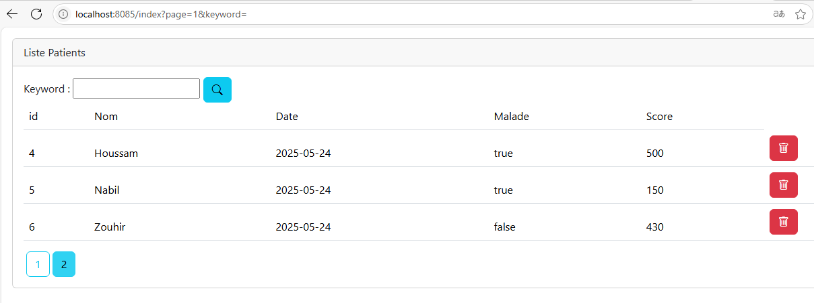
    <li>Chercher les patients</li>
    
ici quand j'ai fait une recherche sur patient "Nabil" il affiche le resultat correspondant : 

    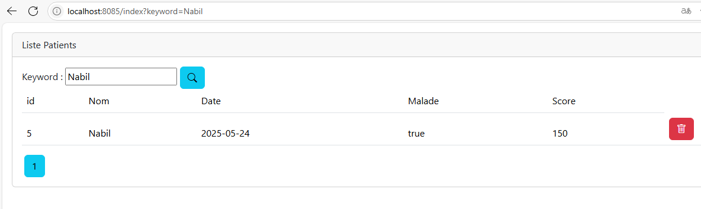
    <li>Supprimer un patient</li>
    
Pour faire une supprission, il faut d'abord notifier l'utilisateur : 

    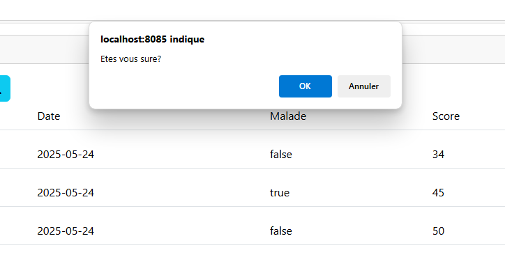
    
Puis , validation de l'opération et redirect vers la même page : 

    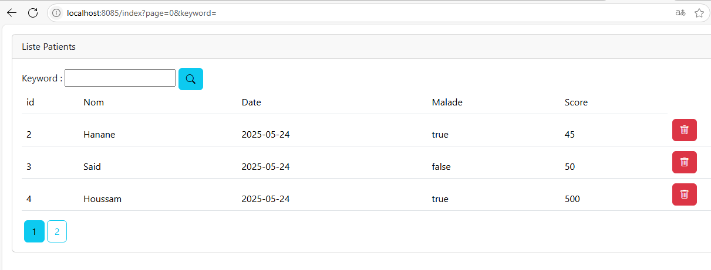
    <li>Faire des améliorations supplémentaires</li>
    
Pour cette partie, on a ajouter des styles en utilisant bootstrap et bootstrap-icons : 

    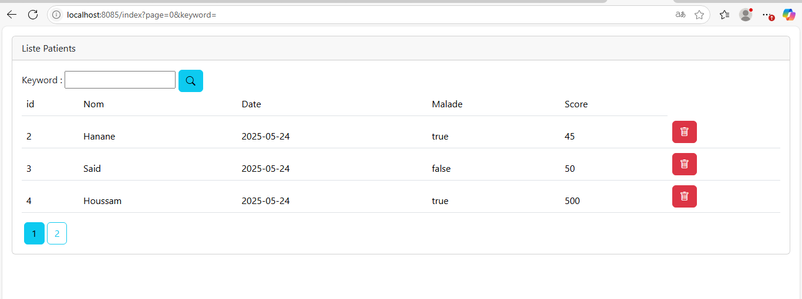
</ol>

<h2 style="text-align:center; color:red;">Partie 2</h2>
<ol>
    <li>Créer une page template : </li>
    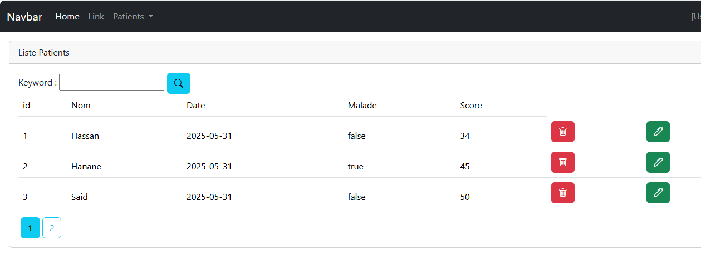
    <li>Faire la validation des formulaires : </li>
    
Pour save : 

    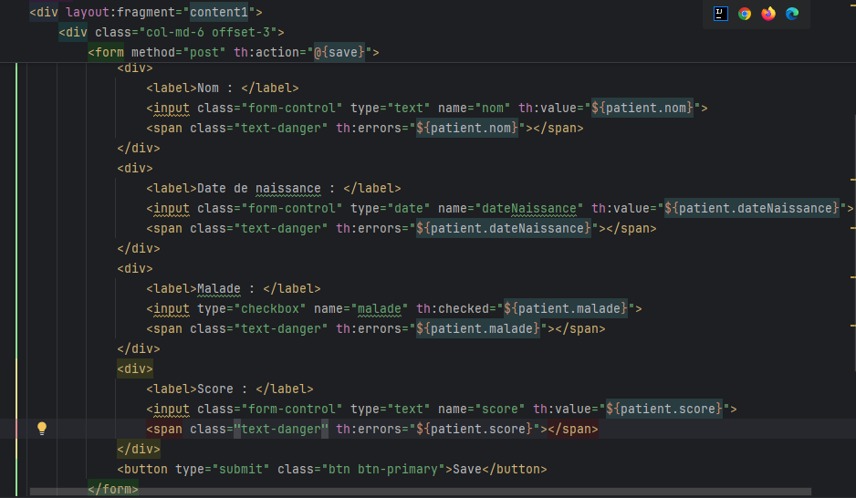
    => Résultat :  
    &nbsp; * Remplissage du formulaire :  
    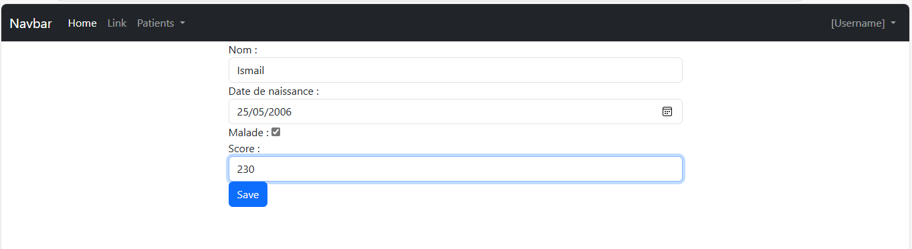
    &nbsp; *Résultat après l'ajout :  
    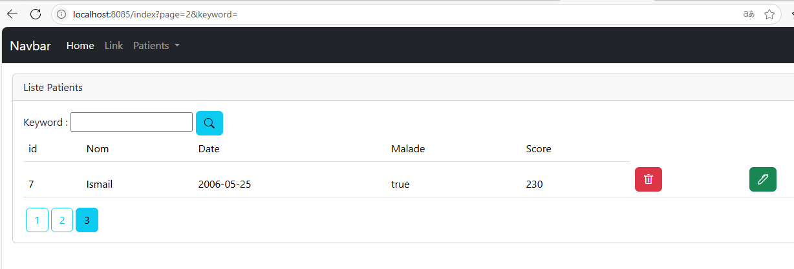
    
Pour edit : 

    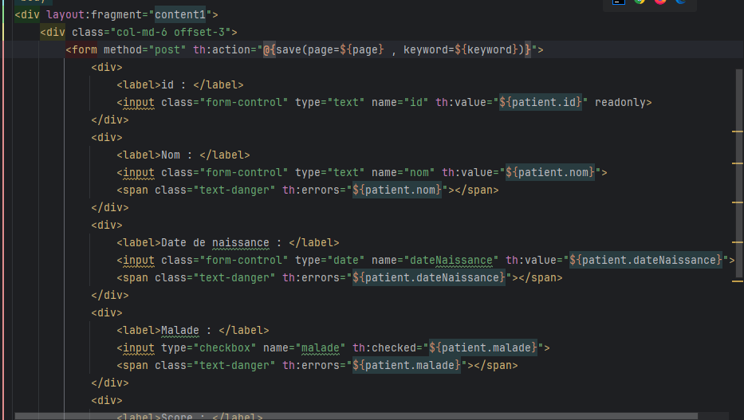
    => Résultat :  
    &nbsp; * ici, on va modifier les infos de ce patient :
    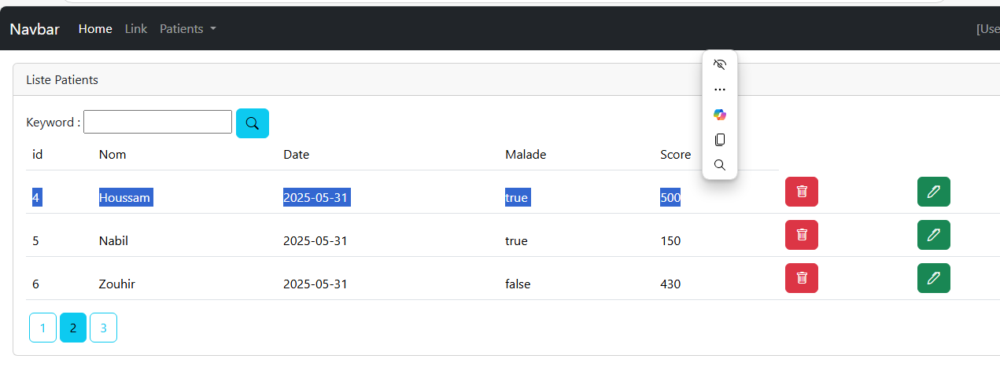
    &nbsp; * Voici les nouveaux infos :  
    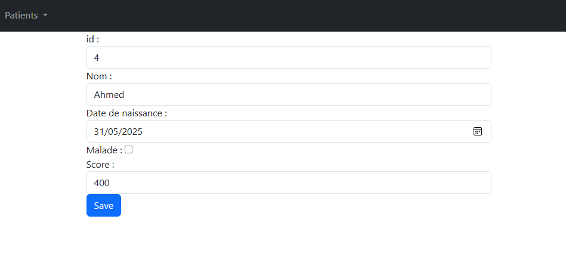
    &nbsp; * et voilà notre patient :  
    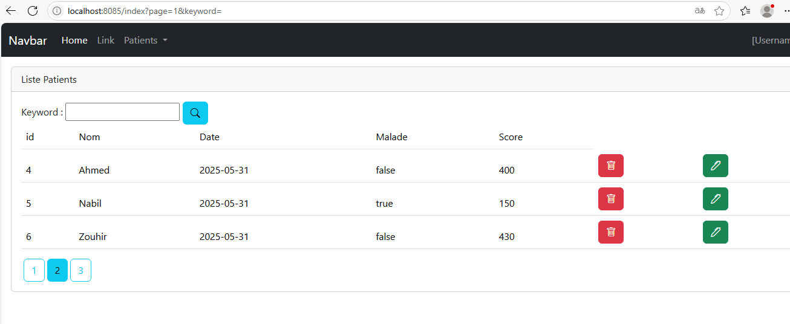
</ol>

