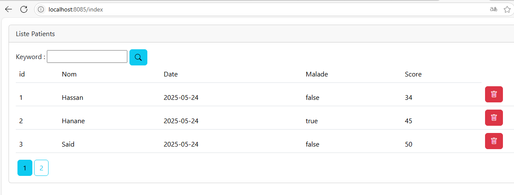

# OUMOULAY Rashid
# Master SDIA
# Sys_Dist TP03

<h2 style="text-align:center;">Partie 1</h2>

<h4>&nbsp; Objectif :</h4>
    &nbsp;Créer une application Web JEE basée sur Spring MVC, Thylemeaf et Spring Data JPA qui permet de gérer les patients. 
    L'application doit permettre les fonctionnalités suivantes :
    <ul>
        <li>Afficher les patients</li>
        <li>Faire la pagination</li>
        <li>Chercher les patients</li>
        <li>Supprimer un patient</li>
        <li>Faire des améliorations supplémentaires</li>
    </ul>
<ol>
    <li>Afficher les patients</li>
    
    
    <li>Faire la pagination</li>
    <li>Chercher les patients</li>
    <li>Supprimer un patient</li>
    <li>Faire des améliorations supplémentaires</li>
</ol>
    

